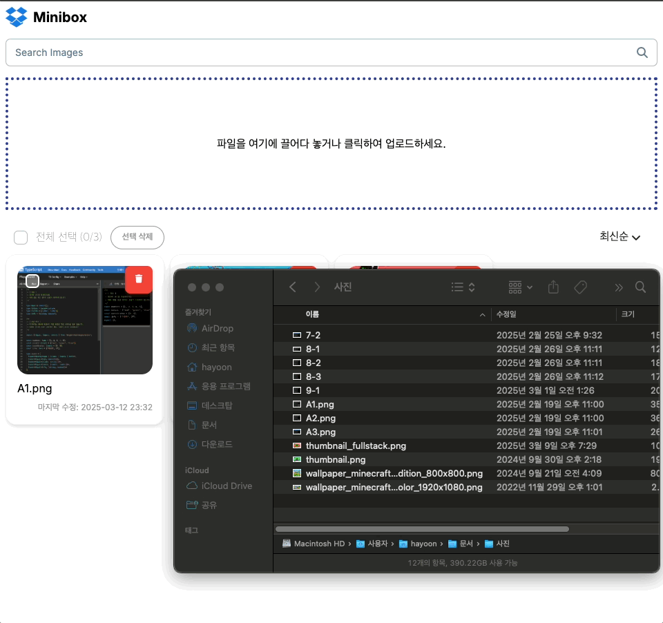
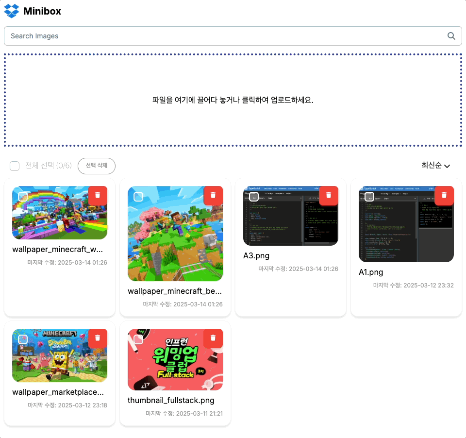
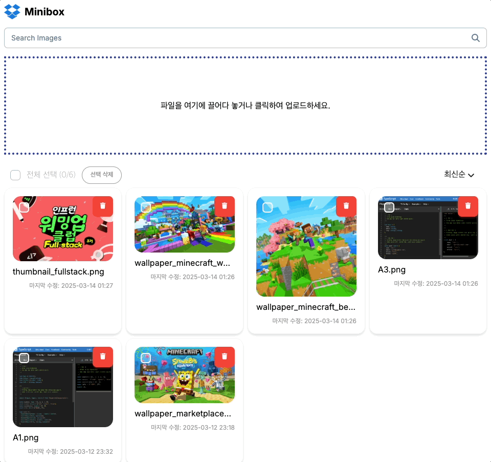
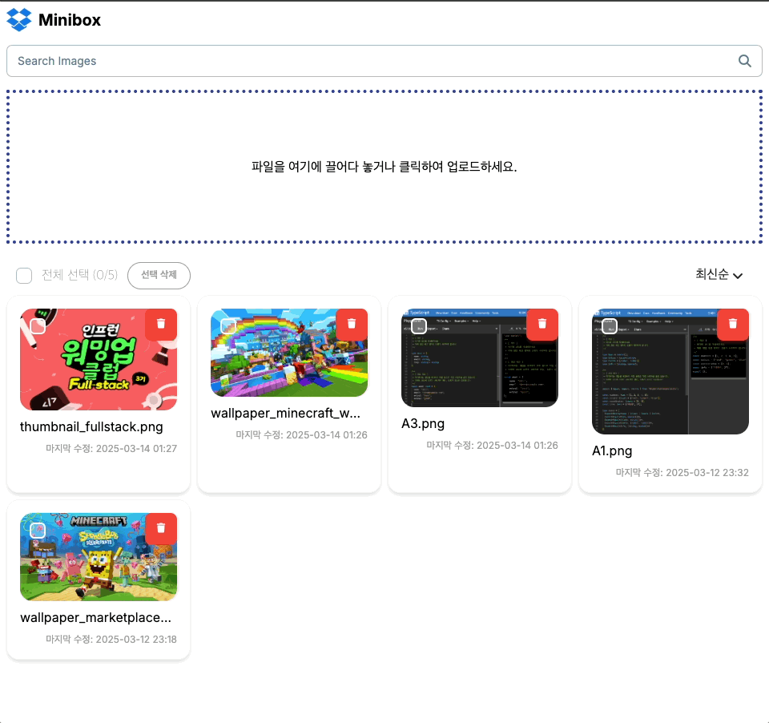

## DropBox Clone

---

Next.js(Server Action, React Query, Material Tailwind) + Supabase

인프런 워밍업 스터디 3기 풀스택 미션2 입니다.  
[강의: [풀스택 완성]Supabase로 웹사이트 3개 클론하기(Next.js 14)](https://www.inflearn.com/course/%EC%9A%94%EC%A6%98%EC%97%94-supabase-%EB%8C%80%EC%84%B8%EC%A7%80-nextjs-%ED%81%B4%EB%A1%A0%ED%94%84%EB%A1%9C%EC%A0%9D%ED%8A%B8/dashboard)

- 사진 다중 업로드  
    
  `react-dragzone` 라이브러리 사용

- 사진 업데이트  
  

- 사진 정렬 (추가 구현)  
  

- 사진 검색  
  

- 사진 개별 삭제  
  

- 사진 다중 삭제 (추가 구현)  
  
